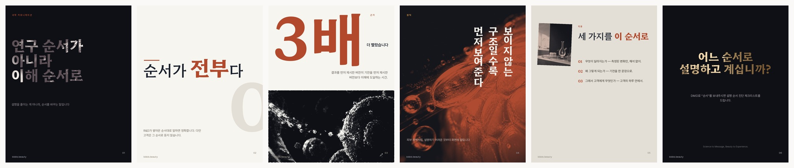

# Editorial Direction — Instagram 카드

`scripts/editorial_cards.py` 가 그리는 4:5(1080×1350) 카드의 근거입니다.

## 왜 세 번 다시 그렸나

**v1 — 슬롯을 채우는 템플릿.** 6장이 전부 같은 값이었습니다. 좌측 마진 84px,
헤드라인 시작 y 230px, 레일 y 992px, 고스트 번호 460px 우하단, 스티커 2개 —
전부 6/6 동일. 이미지는 0/6 사용. 스티커 배치 근거는 `rotation = index * 13`
이었습니다. 슬롯이 있어서 채운 장식입니다.

**v2 — 구성은 고쳤지만 조판은 그대로.** 역할별 구성을 도입했는데도 6장 전부
x=64 좌측 정렬, 헤드라인은 전부 정확히 2줄, 이미지 슬라이드는 둘 다 "하단
그라디언트로 어둡게 깔고 그 위에 흰 글씨", 한 헤드라인 안의 굵기 변화 없음,
요소끼리 겹치는 곳 없음. 그 정중함이 기계 티였습니다.

**v3 — 조판까지.** 아래가 현재 상태입니다.

## 역할

템플릿 하나에 내용을 넣는 대신, 슬라이드마다 자기 구성이 있습니다.

| 역할 | 구성 |
|---|---|
| `cover` | 전면 사진, 헤드라인을 **사진에서 도려냄**(녹아웃) |
| `statement` | 이미지 없음. 타입이 프레임을 채우고, 인덱스 숫자가 그 뒤에 깔림 |
| `evidence` | 수치가 곧 그림. 위쪽 가장자리에서 잘려나가고, 아래는 하프톤 판형 |
| `vertical` | **세로쓰기.** 전면 듀오톤 위 오른쪽→왼쪽 칼럼 |
| `detail` | 판형을 2.2° 틀고, 리스트는 우측 컬럼에만 |
| `close` | 녹아웃 재사용, 유일하게 가운데 정렬 |

캐러셀은 `render_daily.py::CAROUSEL_ROLES` 순서로 돌되 마지막은 항상 `close`
입니다. 버퍼의 슬라이드가 `role` 을 지정하면 그게 우선합니다.

고정되는 것은 **워드마크·인덱스·팔레트 셋뿐**입니다. 하나의 덱으로 읽힐 만큼만,
하나의 템플릿으로 읽히지 않을 만큼.

## 조판

- **녹아웃** — 사진 위에 텍스트를 얹지 않고 글자로 사진을 도려냅니다. "하단을
  어둡게 깔고 흰 글씨"는 템플릿의 대표 수법이라 버렸습니다.
- **헤드라인 안의 강조** — `순서가 *전부*다` 에서 전부만 1.35배 크기·Bold·클레이로.
  한 줄이 두 목소리를 냅니다.
- **겹침** — 560px 인덱스 숫자를 먼저 깔고 헤드라인이 그 위를 덮습니다.
- **하프톤** — 15° 회전 망점. 필터가 아니라 인쇄 아티팩트입니다.
- **그레인** — 6%. 완벽하게 깨끗한 그라디언트가 기계 티입니다.
- **듀오톤** — 모든 사진을 휘도→2색 램프로 매핑. 범용 3D 렌더가 아트 디렉션된
  것으로 읽히는 핵심입니다.

## 팔레트

브랜드 색을 지우지 않고 역할만 바꿨습니다.

| 색 | 값 | 역할 |
|---|---|---|
| Ink / Black | `#1A202C` / `#0E1016` | 어두운 그라운드 |
| Paper / Chalk | `#F7F5F0` / `#E4DFD6` | 밝은 그라운드 |
| Clay | `#B2482C` | 밝은 그라운드의 액센트, 강조어 |
| Amber | `#E29E42` | 어두운 그라운드의 액센트 |
| Rose | `#CEB4A8` | 듀오톤 하이라이트 |

Aqua `#0EA5E9` 는 **어느 표면에도 쓰지 않습니다.** 전면 아쿠아 그라디언트가
피하려는 바로 그 룩이기 때문입니다.

## 타이포그래피

| 역할 | 서체 | 위치 |
|---|---|---|
| 디스플레이 | **Hahmlet** Bold | `assets/fonts/Hahmlet.ttf` |
| 본문·라벨 | **Pretendard** | `assets/fonts/Pretendard.ttf` |
| 폴백 | Noto Serif/Sans CJK | apt (`fonts-noto-cjk`) |

둘 다 저장소에 동봉했습니다. 빌드 시 폰트를 내려받지 않습니다 — 이 파이프라인의
목적이 단일 실패 지점 제거인데 폰트 다운로드로 새 실패 지점을 만들 이유가 없습니다.
라이선스는 둘 다 SIL OFL 1.1이고 원문을 `assets/fonts/` 에 같이 뒀습니다.

### 왜 Noto에서 바꿨나 — 측정값

| | 한 높이 | L/K 비율 | Bold 잉크량 | 용량 |
|---|---:|---:|---:|---:|
| Noto Serif KR *(이전)* | 95 | 78% | 77 | 22.7 MB |
| **Hahmlet** | 91 | 82% | **93** | **3.4 MB** |

- **Bold가 Bold였습니다.** 같은 명목 웨이트에서 Hahmlet의 잉크량이 17% 많습니다.
  변수축은 양쪽 다 정상 작동하며, Noto Serif KR의 Bold가 그냥 가벼운 것입니다.
  이전 카드의 헤드라인이 물러 보였던 원인입니다.
- **L/K 비율** = 라틴 대문자 높이 ÷ 한글 글자 높이. 이 브랜드는 `bbbb.beauty`,
  `MOA`, `IL-6` 를 한글과 계속 섞어 쓰므로, 이 값이 낮으면 라틴이 작아 보여
  수동 보정이 필요합니다. Hahmlet이 82%로 더 잘 맞습니다.
- 용량은 6.7배 작고 웨이트는 하나 더 많습니다.

Pretendard는 인스타그램 압축(50% 리샘플 + q42) 후 15px 각주에서 가장 잘 버팁니다.
단, **등폭 숫자가 아닙니다.** 인라인 수치에는 비례폭이 낫지만, 숫자를 세로로
줄맞춰 쌓아야 하면 그 자리만 Noto Sans KR로 바꾸세요.

### 한글 커버리지 — 실제 위험과 가드

Hahmlet은 현대 한글 11,172 음절 중 **2,788자(KS X 1001 상용 집합)** 만 담고
있습니다. Pretendard는 11,172자 전체를 담습니다.

저장소의 한글을 전수 검사한 결과 — **35,742자, 613종 중 누락 0자**. 일반적인
한국어 산문에는 문제가 없습니다. 위험은 앞으로 자동 생성될 카피, 특히 외래어
음역에 있습니다.

그래서 가정하지 않고 가드를 넣었습니다:

1. `serif_for()` 가 헤드라인을 그리기 전에 Hahmlet의 cmap과 대조합니다.
2. 빠진 글자가 있으면 그 카드만 Noto Serif로 폴백하고 stderr에 기록합니다.
3. 어떤 폴백도 설치돼 있지 않으면 **경고를 크게 출력합니다** — 구멍 난 카드를
   아무 기록 없이 게시하는 것보다 낫습니다.
4. `tests/test_editorial_cards.py` 가 `content/buffer.json` 의 모든 헤드라인을
   미리 검사합니다. 게시 대기 중인 카피는 두부가 날 수 없습니다.

가드는 `fonttools` 에 의존하므로 워크플로가 함께 설치합니다.

모든 텍스트는 그리기 전에 폭을 잽니다. `fit_font()` 이 박스에 들어갈 때까지
크기를 낮추고, `wrap()` 이 공백 없는 한국어 구간을 글자 단위로 끊습니다.
넘칠 수 없습니다.

## 조용히 실패할 수 있는 것 셋 — 전부 측정합니다

렌더러는 파일을 항상 만들어냅니다. 그래서 아래 셋은 재지 않으면 아무도 모르는
채로 게시됩니다.

**1. 텍스트 넘침.** `fit_font()` 이 박스에 들어갈 때까지 크기를 낮추고,
`wrap_runs()` 가 폰트에 폭을 묻습니다. 공백 없는 한국어는 글자 단위로 끊습니다.
넘칠 수 없습니다.

**2. 한글 커버리지.** 위 타이포그래피 절 참조. `serif_for()` 가 그리기 전에
대조하고, 안 되면 카드 단위로 Noto Serif 폴백, 폴백도 없으면 크게 경고합니다.

**3. 녹아웃 대비.** 글자로 도려낸 타입은 **그 자리 사진만큼만 읽힙니다.**
균일하게 어두운 사진에 녹아웃을 하면 검정 위 검정이 되어 헤드라인이 사라지는데,
파일은 멀쩡히 나옵니다. `_knockout_is_legible()` 이 마스크 영역의 평균 휘도를
그라운드와 비교해서, 차이가 52 미만이면 스크림 방식으로 떨어뜨리고 기록합니다.

**반투명은 반드시 합성으로.** `_layer()` 로 투명 RGBA 레이어를 만들고
`Image.alpha_composite()` 로 합칩니다. `ImageDraw` 로 RGBA 이미지에 직접 그리면
알파가 블렌딩되지 않고 덮어써집니다 — v1의 패널이 정확히 그 버그였습니다.

## 이미지

`editorial_cards.available_images()` 가 저장소의 소스 렌더 13장을 모읍니다
(`images/concepts/visual-directions-v3/`, `images/tests/scientific-choreography/`,
`images/replacements/body-cell-narrative/`). 버퍼가 이름을 주면 부분 일치로 찾고,
없으면 인덱스로 결정론적으로 고릅니다. **이름이 틀려도 일일 실행이 죽지 않습니다.**
