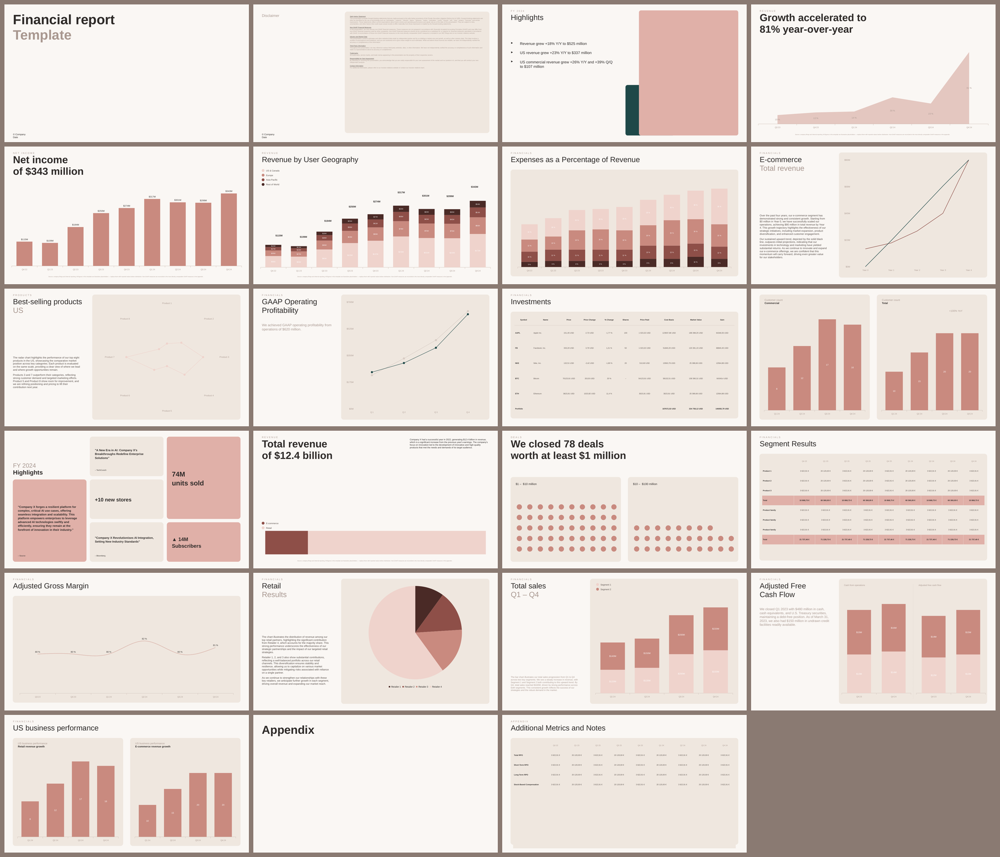
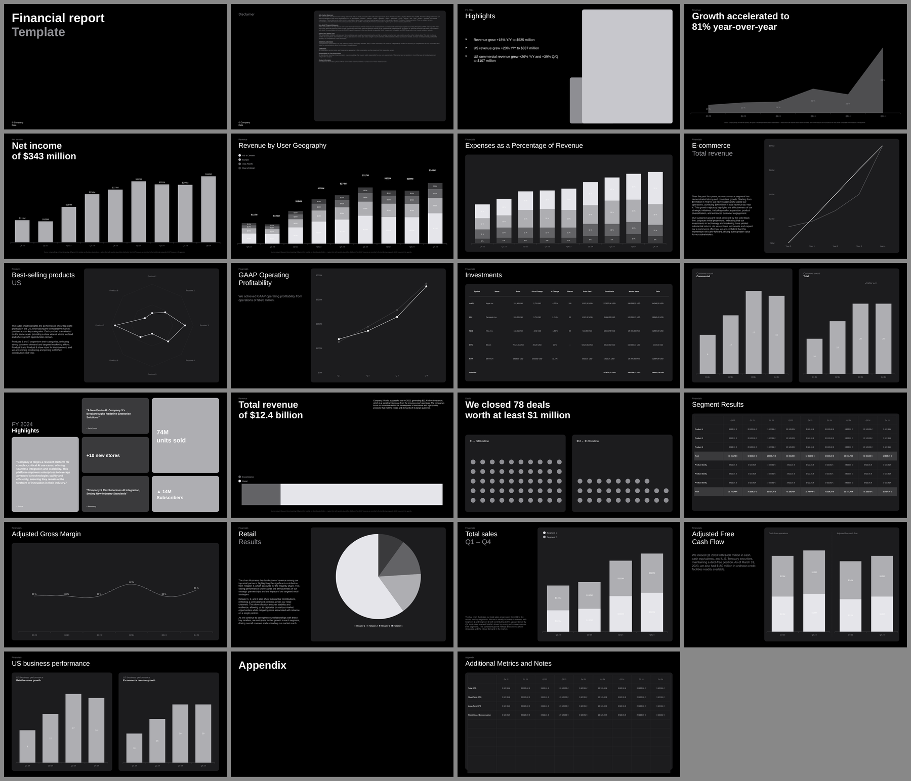
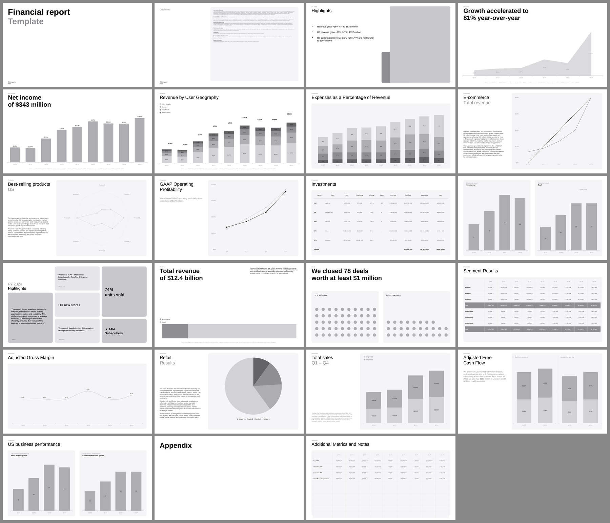

# Financial report template (Google Slides)

23-slide "Financial report" deck in the mono-chrome Helvetica/Arial style from the
reference screen recording, generated as native PowerPoint files that Google Slides
imports directly (all charts and tables stay editable).

| File | Theme |
|---|---|
| `financial-report-dark.pptx` | black background, white type |
| `financial-report-light.pptx` | white background, black type |
| `financial-report-editorial.pptx` | warm cream ground, blush blocks, one deep teal accent |





## The editorial theme

Palette sampled from a reference board of fashion-editorial layouts, so the
numbers below are measured from that image rather than invented:

| role | hex |
|---|---|
| page | `#FAF7F4` |
| card | `#EFE7DF` |
| blush block | `#E0B0A8` |
| teal accent | `#1E4848` |
| ink | `#2E2A28` |

Two rules carry the look:

- **Section labels are uppercase and widely tracked** (`track` / `labelUpper` on
  the theme). That single move does most of the editorial work.
- **An accent block sits behind the image well, offset down-left**, so a strip of
  colour shows past the photo's edge. Flat fills only — a transparent wash over a
  warm ground turns muddy.

Chart series are a **single-hue sequential ramp**, `#EFD3CC → #C98A80 → #8E4F48 →
#4A2A26`, monotonic in OKLab lightness (0.888 / 0.694 / 0.500 / 0.325) and checked
for adjacent-pair separation. Teal is deliberately kept out of the ramp so it can
still mean "look here". Segments carry direct labels, which is what discharges the
low contrast of the lightest step against the cream card.

Typography is Arial throughout. The reference pairs a display serif with a
geometric sans; swap `FONT` if you have a licensed display face, but note that
LibreOffice-based previews only render true-to-width for metric-safe fonts.

## Slides
1. Cover — *Financial report / Template*
2. Disclaimer (safe-harbor block)
3. FY 2024 Highlights — bullet list + image placeholder
4. Growth accelerated to 81% year-over-year — area chart
5. Net income of $343 million — column chart
6. Revenue by User Geography — stacked column, 4 regions
7. Expenses as a Percentage of Revenue — stacked column in card
8. E-commerce / Total revenue — line chart vs. projection + copy
9. Best-selling products / US — radar chart + copy
10. GAAP Operating Profitability — line chart with markers
11. Investments — portfolio table
12. Customer count — Commercial / Total bar cards (+100% YoY)
13. FY 2024 Highlights — bento grid (quotes + stats)
14. Total revenue of $12.4 billion — horizontal stacked bar
15. We closed 78 deals worth at least $1 million — dot grids
16. Segment Results — 9-quarter table
17. Adjusted Gross Margin — dotted line
18. Retail Results — pie + copy
19. Total sales Q1 – Q4 — stacked column + copy
20. Adjusted Free Cash Flow — two stacked columns
21. US business performance — Retail / E-commerce bar cards
22. Appendix — section divider
23. Additional Metrics and Notes — table with empty rows

## Open in Google Slides
1. Upload either `.pptx` to Google Drive (or *Slides → File → Import slides*).
2. Drive converts it to a Google Slides document automatically; charts arrive as
   editable charts, tables as tables. Font is Arial so nothing gets substituted.

## Rebuild
```bash
npm install
npm run build            # both themes
node build_deck.js dark  # one theme
```
All colours live in the `THEMES` block at the top of `build_deck.js`; slide content is one
function per slide in the `SLIDES` array. Every number in the deck is an illustrative
placeholder — replace before distribution.
